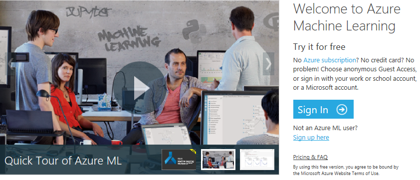
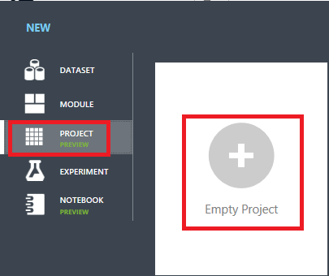
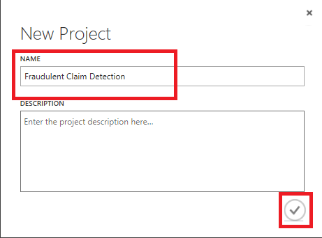

# Fraudulent Claim Detection in Insurance Using Azure Machine Learning Studio #

[Microsoft Azure Machine Learning Studio](https://docs.microsoft.com/en-us/azure/machine-learning/studio/what-is-ml-studio "Microsoft Azure Machine Learning Studio") is a collaborative, drag-and-drop tool you can use to build, test, and deploy predictive analytics solutions on your data. Machine Learning Studio publishes models as web services that can easily be consumed by custom apps or BI tools such as Excel.

Machine Learning Studio is where data science, predictive analytics, cloud resources, and your data meet.

## The Machine Learning Studio interactive workspace ##

To develop a predictive analysis model, you typically use data from one or more sources, transform and analyze that data through various data manipulation and statistical functions, and generate a set of results. Developing a model like this is an iterative process. As you modify the various functions and their parameters, your results converge until you are satisfied that you have a trained, effective model.

**Azure Machine Learning Studio** gives you an interactive, visual workspace to easily build, test, and iterate on a predictive analysis model. You drag-and-drop **_datasets_** and analysis **_modules_** onto an interactive canvas, connecting them together to form an **_experiment_**, which you run in Machine Learning Studio. To iterate on your model design, you edit the experiment, save a copy if desired, and run it again. When you're ready, you can convert your **_training experiment_** to a **_predictive experiment_**, and then publish it as a **_web service_** so that your model can be accessed by others.

There is no programming required, just visually connecting datasets and modules to construct your predictive analysis model.

In this lab, you will create an Azure Machine Learning Studio experiment in which you will train a classification model to identify fraudulent claims in a dataset of an Insurance Company. Along the way, you will learn how to expose the trained model as a Web Service and consume it using REST APIs.

### Objectives ###

In this hands-on lab, you will learn how to:

- Create an Azure Machine Learning Studio Project
- Add a dataset and train a Classification model in an experiment using labelled claims
- Test the trained Classification model 
- Create apps that leverage the Classification model by calling REST APIs 

### Prerequisites ###

The following are required to complete this hands-on lab:

- A Microsoft Azure Machine Learning Studio account. If you don't have one, [sign up for free](https://studio.azureml.net/) - click on "Sign up here". Please choose the **_Standard Workspace_** option when prompted.
- Microsoft [Visual Studio Code](http://code.visualstudio.com) version 1.14.0 or higher
- [Node.js](https://nodejs.org) version 6.0 or higher

### Resources ###

All the resources you need are all located inside this repository where this README exists as well.

You should first either clone this repository, or download and unpack it onto your hard drive.

This repository itself contains the following sub-folders:

* `Experiment data` - a .csv file containing the training data we are going to use (labelled claims)
* `Using Azure Machine Learning Web Service to Predict Claim Fraud/Client/Fraud Detector/` - a desktop app written in Electron which you will use to test your Classification model (contains test data as well)
* `images` - different images used throughout this README

### Cost ###

There is no cost associated with this lab because it doesn't require an Azure subscription.

### Terminology ###

Azure Machine Learning Studio is going to be referenced hereinafter as AML Studio.

## Exercises ##

This hands-on lab includes the following exercises:

- [Exercise 1: Create an AML Studio project](#Exercise1)
- [Exercise 2: Upload training dataset](#Exercise2)
- [Exercise 3: Train the Classification model in an AML Studio Experiment](#Exercise3)
- [Exercise 4: Evaluate the model and increase performance](#Exercise4)
- [Exercise 5: Create a Node.js app that uses the model](#Exercise5)
- [Exercise 6: Use the app to classify new claims](#Exercise6)

Estimated time to complete this lab: **45** minutes.

## Exercise 1: Create an AML Studio project ##

The first step in building a classification model within AML Studio is to create a project. In this exercise, you will use the AML Studio portal to create a 

1. Open the [AML Studio portal](https://studio.azureml.net/) in your browser. Then click **Sign In**. 
 
    

    _Signing in to the AML Studio portal_

1. If you are asked to sign in, do so using the credentials for your Microsoft account. If you are asked to let this app access your info, click **Yes**, and if prompted, agree to the terms of service.

1. Click **New** >> **Project** > **Empty Project** to create a new empty project.
  
	

    _Creating a new resource_
	
	

    _Choosing to create an empty project_

1. In the "New project" dialog, name the project **Fraudulent Claim detection** and click **Ok**.

	

    _Creating an AML Studio project_

The next step is to upload the claims dataset to be used for training to the project.
